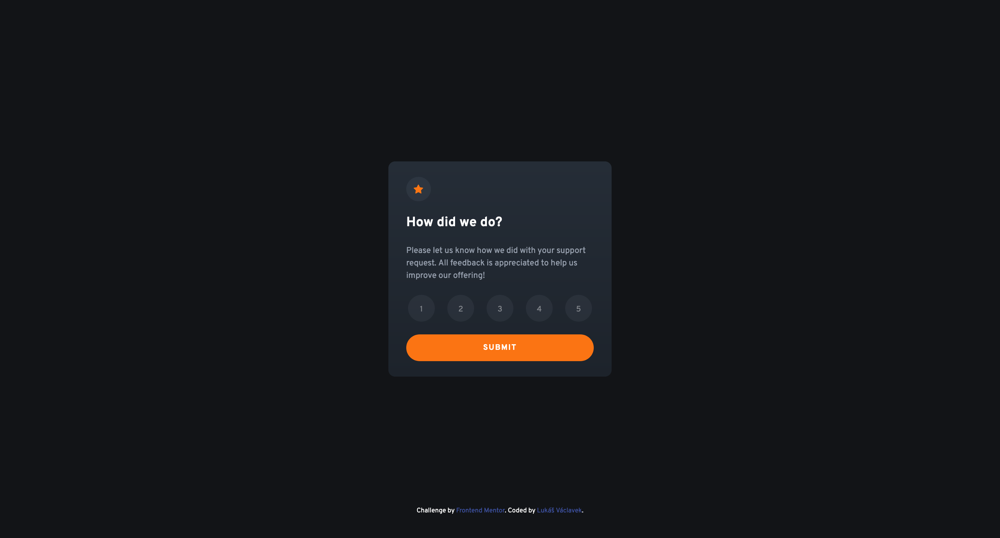
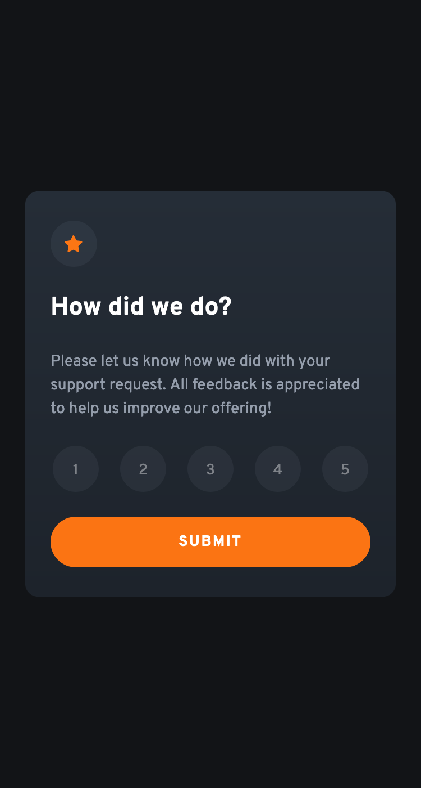

# Frontend Mentor - Interactive rating component solution

This is a solution to the [Interactive rating component challenge on Frontend Mentor](https://www.frontendmentor.io/challenges/interactive-rating-component-koxpeBUmI). Frontend Mentor challenges help you improve your coding skills by building realistic projects.

## Table of contents

- [Overview](#overview)
  - [The challenge](#the-challenge)
  - [Screenshot](#screenshot)
  - [Links](#links)
- [My process](#my-process)
  - [Built with](#built-with)
  - [Useful resources](#useful-resources)
- [Author](#author)

## Overview

### The challenge

Users should be able to:

- View the optimal layout for the app depending on their device's screen size
- See hover states for all interactive elements on the page
- Select and submit a number rating
- See the "Thank you" card state after submitting a rating

### Screenshot

### Links
- Solution URL: [Github Pages](https://vacii.github.io/rating-component/src/)

## My process

### Built with

- Semantic HTML5 markup
- CSS custom properties
- JavaScript
- Flexbox
- Mobile-first workflow
- [TailwindCSS](https://tailwindcss.com/) - CSS Framework

### Useful resources

- [TailwindCSS](https://tailwindcss.com/) - Tailwind has easy and clear documentation which helped me a lot with coding this site
- [HSL to HEX](https://www.w3schools.com/colors/colors_hsl.asp) - This project used a HSL colour palette. I used this HSL to HEX generator to help me convert these colors.

## Author

- Website - [Lukáš Václavek](http://lukasvaclavek.eu/)
- Frontend Mentor - [@Vacii](https://www.frontendmentor.io/profile/Vacii)
